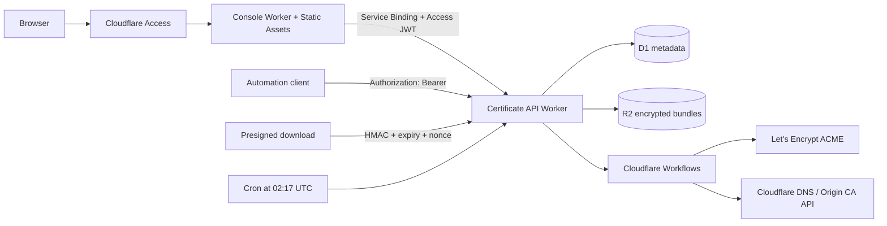

# Certbot Serverless

English | [Chinese](./README_CN.md)

A single-user certificate console running entirely on Cloudflare. It issues two types of certificates:

- **Let's Encrypt** certificates use the Cloudflare DNS API for DNS-01 challenges and support publicly trusted certificates, including wildcards.
- **Cloudflare Origin CA** certificates secure TLS connections from the Cloudflare proxy to an origin server. They are not publicly trusted by browsers.

The console uses React, Vite, Tailwind CSS v4, and shadcn/ui-style components. A dedicated Console Worker serves it with Workers Static Assets. A separate Worker runs the API, scheduled jobs, and issuance workflows. D1 stores metadata, R2 stores certificate bundles and private keys encrypted with AES-256-GCM, and Cloudflare Workflows runs retryable issuance jobs.

## Architecture



The three access paths do not conflict:

1. Cloudflare Zero Trust Access protects the console domain. The Console Worker forwards the Access JWT unchanged through a Service Binding, and the API Worker verifies its signature, issuer, and audience again.
2. Automation clients call the API directly with `Authorization: Bearer <API_BEARER_TOKEN>`.
3. The download endpoint accepts a presigned URL that is valid for no more than one hour, defaults to five minutes, and can be consumed only once.

Do not place the entire API domain behind a catch-all Access application. Doing so would block Bearer-only and presigned-download requests before they reach the Worker. Access should protect the Console Worker, while the API Worker continues to enforce authentication on every non-download API endpoint.

## Repository layout

```text
apps/
  api/                 Worker API, Workflow, and D1 migration
  web/                 Console Worker, Static Assets, and /api Service Binding proxy
scripts/
  init-local-secrets.mjs
STYLE.md               Local UI design guide; intentionally excluded from Git
```

## Local development

Requires Node.js 22 or later and pnpm 11.

```bash
pnpm install
pnpm secrets:local
```

Edit `apps/api/.dev.vars` and replace `CLOUDFLARE_API_TOKEN` with a real, least-privilege API token. The local configuration uses Let's Encrypt staging by default to avoid consuming production issuance limits.

Initialize the local D1 database:

```bash
pnpm exec wrangler d1 migrations apply certbot-serverless --local -c apps/api/wrangler.jsonc
```

Start the frontend and API:

```bash
pnpm dev
```

- Console UI: `http://localhost:5173`
- Worker API: `http://localhost:8788`

The Vite proxy reads `apps/web/.env.local` only during local development and adds a Bearer token to `/api` requests. That value is never included in the frontend bundle.

## Cloudflare-managed Git deployment

See [DEPLOYMENT.md](./DEPLOYMENT.md) for the complete first-time deployment, secret initialization, domain, Zero Trust, validation, and troubleshooting instructions. The following is a configuration summary.

GitHub Actions is not required. Cloudflare builds two projects directly from the same GitHub repository:

1. `certbot-serverless-api`: Workers Builds deploys the API, Workflow, Cron Trigger, and D1 migrations.
2. `certbot-serverless-console`: Workers Builds deploys the React static assets and `/api` Service Binding proxy.

Workers Builds injects non-sensitive production settings into temporary configuration files. Runtime secrets are written to the Worker during initial setup and are preserved by later deployments. Temporary files exist only in the build container and are neither committed to Git nor printed to build logs.

### 1. Create D1 and R2 once

Create the resources in the dashboard or with Wrangler:

```bash
pnpm exec wrangler login
pnpm exec wrangler d1 create certbot-serverless --location apac
pnpm exec wrangler r2 bucket create certbot-serverless-certificates --location apac
```

Save the Database ID returned by D1. Add it only as a Cloudflare Build Variable; do not edit or commit it to the repository's `wrangler.jsonc`.

### 2. Create the API Worker Build

In Workers & Pages, create or select a Worker named `certbot-serverless-api`, then connect the GitHub repository. The Worker name must match the `name` in `apps/api/wrangler.jsonc`.

Build settings:

| Setting | Value |
| --- | --- |
| Production branch | `main` |
| Root directory | Leave blank to use the repository root |
| Build command | `pnpm cf:render && pnpm --filter @certbot/api typecheck` |
| Deploy command | `pnpm cf:deploy` |

Build environment versions:

| Build variable | Value |
| --- | --- |
| `NODE_VERSION` | `22` |
| `PNPM_VERSION` | `11.26.0` |

`pnpm cf:render` generates `apps/api/wrangler.generated.jsonc` from the checked-in template. `pnpm cf:deploy` applies remote D1 migrations, deploys the Worker with the generated configuration, and deletes temporary files. The initial bootstrap can also generate a one-time secret file; regular Git builds do not generate or upload secret files.

### 3. Configure API Build Variables

Under **Settings → Builds → Variables and secrets**, add these non-sensitive Build Variables:

| Build variable | Value |
| --- | --- |
| `D1_DATABASE_ID` | The D1 Database ID created above |
| `DOWNLOAD_URL_BASE` | The public HTTPS API address, such as `https://cert-api.example.com` |
| `ACCESS_TEAM_DOMAIN` | The Access Team Domain, such as `https://your-team.cloudflareaccess.com` |
| `ACCESS_AUD` | The Console Access application's Audience Tag |

These values only render the deployment configuration. `apps/api/wrangler.jsonc` keeps generic placeholders and contains no account-specific values.

### 4. Initialize API Runtime Secrets once

Before the first deployment, use Wrangler or **Settings → Variables and Secrets** on the Worker to configure:

| Worker Secret | Purpose |
| --- | --- |
| `CLOUDFLARE_API_TOKEN` | DNS-01 and Origin CA API access |
| `API_BEARER_TOKEN` | Automation API authentication |
| `DOWNLOAD_SIGNING_KEY` | HMAC presigned downloads; 32-byte base64 value |
| `CERTIFICATE_MASTER_KEY` | R2 content encryption; 32-byte base64 value |
| `ACME_ACCOUNT_KEY` | ACME account private key in PKCS#8 PEM format |

After initialization, these values do not need to be copied into Workers Builds. A regular `wrangler deploy` preserves existing secrets, and `secrets.required` prevents deployment when any required secret is missing. Rotate values later with `wrangler secret put` or the dashboard.

`ACME_ACCOUNT_KEY` must contain the complete multiline PEM. Generate the other values with:

```bash
openssl rand -base64 32 # API_BEARER_TOKEN
openssl rand -base64 32 # DOWNLOAD_SIGNING_KEY
openssl rand -base64 32 # CERTIFICATE_MASTER_KEY
openssl genpkey -algorithm EC -pkeyopt ec_paramgen_curve:P-256 -out acme-account.pem
```

The runtime Cloudflare API token needs at least these permissions in production:

- Zone / Zone / Read
- Zone / DNS / Edit
- Zone / SSL and Certificates / Edit

Restrict the token to the zones for which this application issues certificates.

The deploy command runs D1 migrations. Cloudflare normally generates a suitable Workers Builds deployment token automatically. Only select a custom token under **Settings → Builds → API token** if the build log explicitly reports missing permissions. A custom token may need:

- Account / Workers Scripts / Edit
- Account / D1 / Edit
- Account / Workers R2 Storage / Edit
- Account / Account Settings / Read
- Zone / Workers Routes / Edit when deploying a custom domain or route

The deployment token and `RUNTIME_CLOUDFLARE_API_TOKEN` serve different purposes and must not be confused.

### 5. Create the Console Worker Build

Import the same GitHub repository as a Worker named `certbot-serverless-console`. The name must match `apps/web/wrangler.jsonc`.

| Setting | Value |
| --- | --- |
| Production branch | `main` |
| Root directory | `apps/web` |
| Build command | `pnpm build` |
| Deploy command | `pnpm exec wrangler deploy` |

Console Build Variables:

| Variable | Value |
| --- | --- |
| `NODE_VERSION` | `22` |
| `PNPM_VERSION` | `11.26.0` |

The production configuration in `apps/web/wrangler.jsonc` already declares:

- Worker name `certbot-serverless-console`
- Static Assets directory `./dist` with SPA fallback
- Worker-first handling only for `/api` and `/api/*`
- An `API` Service Binding targeting `certbot-serverless-api`

Workers Builds does not need a separate build output directory. Wrangler reads `assets.directory` and uploads `./dist`. Do not duplicate the Service Binding in the dashboard. Deploy the API Worker successfully before deploying the Console Worker, and make sure the JSONC configuration has been committed and pushed before the Git build runs.

### 6. Subsequent deployments

After the one-time setup, every push to `main` triggers Cloudflare builds and deployments. No local login, production configuration generation, or deployment command is required.

Keep non-production branch builds disabled unless they use isolated D1, R2, Access, secret, and Worker environments.

## Zero Trust configuration

1. Open **Workers & Pages → certbot-serverless-console → Access**, choose **Protect this Worker behind Access**, and protect all traffic.
2. Create an Allow policy containing only your exact email address or an explicit identity-provider group. Do not use `Include Everyone`.
3. Copy the Audience Tag from the generated Console Access application into the API Build variable `ACCESS_AUD`.
4. Put the complete Team Domain into the API Build variable `ACCESS_TEAM_DOMAIN`, then redeploy the API Worker.
5. Open the console and confirm that `/api/me` returns `method: access`.
6. Keep the API Worker's custom domain routable. The API Worker validates an Access JWT or Bearer token for `/api/*` and a presigned signature for `/download/*`.

Access signing keys rotate. The Worker validates against the remote Access JWKS endpoint rather than pinning a public key.

Automation clients should call the API Worker domain directly without Access and authenticate with the application-level Bearer token. This is the project's machine-access path, not an unauthenticated bypass. Access also supports Service Auth using `CF-Access-Client-Id` and `CF-Access-Client-Secret`; that option is useful when machine requests require Access auditing, but it is unsuitable for presigned downloads that cannot add headers. Do not use a broad Bypass policy as permanent machine authentication. If a public callback is unavoidable, limit the bypass to the narrowest possible path.

## API

Except for the health check and presigned downloads, every `/api/*` endpoint accepts either a valid Access JWT or Bearer token.

| Method | Path | Description |
| --- | --- | --- |
| `GET` | `/api/health` | Non-sensitive health check |
| `GET` | `/api/overview` | Console statistics and recent jobs |
| `GET` | `/api/certificates` | List certificates |
| `POST` | `/api/certificates` | Create a certificate and start its Workflow |
| `GET` | `/api/certificates/:id` | Certificate, version, and job details |
| `PATCH` | `/api/certificates/:id` | Enable or disable automatic renewal |
| `POST` | `/api/certificates/:id/renew` | Renew immediately |
| `POST` | `/api/certificates/:id/download-link` | Create a one-time download link |
| `DELETE` | `/api/certificates/:id` | Delete stored data and revoke an Origin CA certificate |
| `GET` | `/api/jobs/:id` | Get a job |
| `GET` | `/api/audit` | Get the latest 100 audit records |

Example:

```bash
curl https://cert-api.example.com/api/certificates \
  -H "Authorization: Bearer $CERTBOT_TOKEN"
```

The downloaded ZIP contains `cert.pem`, `chain.pem`, `fullchain.pem`, `privkey.pem`, `request.csr`, and `metadata.json`.

## Renewal behavior

- A scheduled job scans for certificates in their renewal window every day at `02:17 UTC`.
- Let's Encrypt certificates renew 30 days before expiry by default.
- Origin CA certificates renew 60 days before expiry by default; a 15-year validity period is the default choice.
- Every renewal creates a new certificate private key and R2 version. Older versions remain available for origin rollback.
- A certificate with an existing queued or running job does not start a duplicate job.

## Validation

```bash
pnpm check
```

This runs TypeScript checks, unit tests, the production Console Static Assets build, and `wrangler deploy --dry-run` for both Workers. Real issuance and deployment require resources and secrets from your Cloudflare account, so repository tests never call production APIs.

## References

- [Cloudflare Access JWT validation](https://developers.cloudflare.com/cloudflare-one/access-controls/applications/http-apps/authorization-cookie/validating-json/)
- [Workers Static Assets](https://developers.cloudflare.com/workers/static-assets/)
- [Workers Service Bindings](https://developers.cloudflare.com/workers/runtime-apis/bindings/service-bindings/)
- [Cloudflare Origin CA](https://developers.cloudflare.com/ssl/origin-configuration/origin-ca/)
- [Cloudflare Workflows](https://developers.cloudflare.com/workflows/)
- [Let's Encrypt DNS-01](https://letsencrypt.org/docs/challenge-types/#dns-01-challenge)
