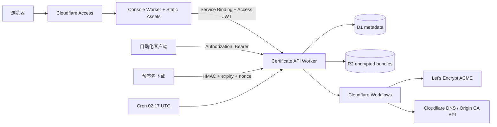

# Certbot Serverless

一个运行在 Cloudflare 上的单用户证书控制台。它签发两类证书：

- **Let's Encrypt**：通过 Cloudflare DNS API 完成 DNS-01，可签发公开可信证书和通配符证书。
- **Cloudflare Origin CA**：用于 Cloudflare 代理到源站的 TLS；它不是浏览器公开信任的 CA。

前端是 React、Vite、Tailwind v4 和 shadcn/ui 风格组件，由独立的 Console Worker 通过 Workers Static Assets 托管。API、定时任务和签发流程运行在另一个 Worker；D1 保存元数据，R2 保存经 AES-256-GCM 加密的证书与私钥，Workflows 承载可重试的签发任务。

## 架构



三种入口互不冲突：

1. 管理台域名由 Zero Trust Access 保护，Access JWT 由 Console Worker 通过 Service Binding 原样转交给 API Worker，API Worker再次校验签名、issuer 和 audience。
2. 自动化请求直接使用 `Authorization: Bearer <API_BEARER_TOKEN>`。
3. 下载端点使用最多 1 小时、默认 5 分钟且只能消费一次的预签名 URL。

不要给整个 API 域名再套一个通配的 Access Application，否则只有 Bearer 或预签名参数的请求会在到达 Worker 前被 Access 拦截。Access 应保护 Console Worker 的管理台域名；API 的每个非下载端点仍由 API Worker 强制认证。

## 仓库结构

```text
apps/
  api/                 Worker API、Workflow、D1 migration
  web/                 Console Worker、Static Assets 和 /api Service Binding 代理
scripts/
  init-local-secrets.mjs
STYLE.md               界面设计规范
```

## 本地开发

要求 Node.js 22+ 和 pnpm 11。

```bash
pnpm install
pnpm secrets:local
```

编辑 `apps/api/.dev.vars`，将 `CLOUDFLARE_API_TOKEN` 替换成真实的最小权限 API Token。本地配置默认使用 Let's Encrypt staging，避免消耗生产环境签发限额。

初始化本地 D1：

```bash
pnpm exec wrangler d1 migrations apply certbot-serverless --local -c apps/api/wrangler.jsonc
```

启动前后端：

```bash
pnpm dev
```

- Console UI：`http://localhost:5173`
- Worker API：`http://localhost:8788`

Vite 代理只在本地读取 `apps/web/.env.local`，并为 `/api` 请求附加 Bearer Token；该值不会进入前端产物。

## Cloudflare 托管的 Git 部署

本项目不需要 GitHub Actions。Cloudflare 直接从同一个 GitHub 仓库构建两个项目：

1. `certbot-serverless-api`：Workers Builds 负责 API、Workflow、Cron 和 D1 migration。
2. `certbot-serverless-console`：Workers Builds 负责 React 静态资源和 `/api` Service Binding 代理。

非敏感生产配置由 Workers Builds 的变量注入临时文件；运行时 Secret 在首次初始化时写入 Worker，后续部署会保留。临时文件只存在于构建容器，不会写回 Git，也不会输出值到构建日志。

### 1. 一次性创建 D1 和 R2

可以在 Dashboard 创建，也可以在本地使用 Wrangler：

```bash
pnpm exec wrangler login
pnpm exec wrangler d1 create certbot-serverless --location apac
pnpm exec wrangler r2 bucket create certbot-serverless-certificates --location apac
```

保存 D1 返回的 Database ID。它只需要填入 Cloudflare 的 Build Variable，不需要修改或提交仓库中的 `wrangler.jsonc`。

### 2. 创建 API Worker Build

在 Workers & Pages 中创建或选择名为 `certbot-serverless-api` 的 Worker，然后连接 GitHub 仓库。Worker 名称必须与 `apps/api/wrangler.jsonc` 中的 `name` 一致。

构建设置：

| Setting | Value |
| --- | --- |
| Production branch | `main` |
| Root directory | 留空，使用仓库根目录 |
| Build command | `pnpm cf:render && pnpm --filter @certbot/api typecheck` |
| Deploy command | `pnpm cf:deploy` |

构建环境版本：

| Build variable | Value |
| --- | --- |
| `NODE_VERSION` | `22` |
| `PNPM_VERSION` | `11.26.0` |

`pnpm cf:render` 读取模板并生成：

- `apps/api/wrangler.generated.jsonc`

`pnpm cf:deploy` 先应用远程 D1 migration，再通过生成配置部署 Worker，最后删除临时文件。首次初始化可以额外生成一次性 Secret 文件；常规 Git Build 不会生成或上传 Secret 文件。

### 3. 配置 API Build Variables

在 Worker 的 **Settings → Builds → Variables and secrets** 中添加以下非敏感 Build Variables：

| Build variable | Value |
| --- | --- |
| `D1_DATABASE_ID` | 第一步创建的 D1 Database ID |
| `DOWNLOAD_URL_BASE` | Worker 的公开 HTTPS 地址，例如 `https://cert-api.example.com` |
| `ACCESS_TEAM_DOMAIN` | Access Team Domain，例如 `https://your-team.cloudflareaccess.com` |
| `ACCESS_AUD` | Console Access Application 的 Audience Tag |

这些值仅用于渲染部署配置。`apps/api/wrangler.jsonc` 保持通用占位符，不保存账户相关内容。

### 4. 一次性初始化 API Runtime Secrets

首次部署前，通过 Wrangler 或 Worker 的 **Settings → Variables and Secrets** 配置以下 Runtime Secrets：

| Worker Secret | 用途 |
| --- | --- |
| `CLOUDFLARE_API_TOKEN` | DNS-01 和 Origin CA API |
| `API_BEARER_TOKEN` | 自动化 API 鉴权 |
| `DOWNLOAD_SIGNING_KEY` | HMAC 预签名下载，32-byte base64 |
| `CERTIFICATE_MASTER_KEY` | R2 内容加密，32-byte base64 |
| `ACME_ACCOUNT_KEY` | ACME 账户 PKCS#8 PEM 私钥 |

初始化完成后不需要把这些值复制到 Workers Builds。普通 `wrangler deploy` 会保留现有 Secret，配置中的 `secrets.required` 会在缺失时阻止部署。需要轮换时再使用 `wrangler secret put` 或 Dashboard 更新。

`ACME_ACCOUNT_KEY` 应是完整的多行 PEM。其余材料可以这样生成：

```bash
openssl rand -base64 32 # API_BEARER_TOKEN
openssl rand -base64 32 # DOWNLOAD_SIGNING_KEY
openssl rand -base64 32 # CERTIFICATE_MASTER_KEY
openssl genpkey -algorithm EC -pkeyopt ec_paramgen_curve:P-256 -out acme-account.pem
```

生产环境的运行时 Cloudflare API Token 至少需要：

- Zone / Zone / Read
- Zone / DNS / Edit
- Zone / SSL and Certificates / Edit

建议把该 Token 限制到需要签发证书的 Zone。

Deploy command 会执行 D1 migration。Workers Builds 的部署 API Token 因此必须包含：

- Account / Workers Scripts / Edit
- Account / D1 / Edit
- Account / Workers R2 Storage / Edit
- Account / Account Settings / Read
- 使用自定义域名或 Route 时：Zone / Workers Routes / Edit

在 **Settings → Builds → API token** 中选择具备这些权限的自定义 Token。这个部署 Token 与 `RUNTIME_CLOUDFLARE_API_TOKEN` 是两个不同用途的 Token。

### 5. 创建 Console Worker Build

从同一个 GitHub 仓库导入一个名为 `certbot-serverless-console` 的 Worker。Worker 名称必须与 `apps/web/wrangler.jsonc` 中的 `name` 一致：

| Setting | Value |
| --- | --- |
| Production branch | `main` |
| Root directory | `apps/web` |
| Build command | `pnpm build` |
| Deploy command | `pnpm exec wrangler deploy` |

Console Build Variables：

| Variable | Value |
| --- | --- |
| `NODE_VERSION` | `22` |
| `PNPM_VERSION` | `11.26.0` |

Console Worker 的生产配置由仓库中的 `apps/web/wrangler.jsonc` 管理，其中已经声明：

- Worker 名称 `certbot-serverless-console`
- Static Assets 目录 `./dist` 和 SPA fallback
- 只有 `/api` 与 `/api/*` 优先运行 Worker 代码
- `API` Service Binding 指向 `certbot-serverless-api`

Workers Builds 不单独显示 Build output directory；Wrangler 会从 `assets.directory` 读取并上传 `./dist`。不需要在 Dashboard 重复添加 Service Binding。先成功部署 API Worker，再部署 Console Worker；Cloudflare Git Build 只有在该 JSONC 文件已经提交并推送后才能读取它。

### 6. 后续部署

完成以上一次性设置后，每次 push 到 `main` 都由 Cloudflare 自动构建和部署，不需要本地登录、生成生产配置或运行部署命令。

API 和 Console 的非生产分支构建建议暂时关闭，除非另外准备隔离的 D1、R2、Access 和 Worker 环境。

## Zero Trust 配置

1. 为 Console Worker 的生产自定义域名创建一个 Self-hosted Access Application。
2. 创建可复用的 Allow Policy，只包含你的邮箱或 IdP 用户组；不要使用 `Include Everyone`。
3. 将 Application Audience Tag 写入 Worker 的 `ACCESS_AUD`。
4. 部署后访问 Console，确认 `/api/me` 返回 `method: access`。
5. API Worker 自定义域名保持可路由，由 API Worker 对 `/api/*` 验证 Access JWT 或 Bearer，对 `/download/*` 验证预签名。

Access 公钥会轮换，Worker 使用 Access 的远程 JWKS 地址动态验证，不固定保存公钥。

自动化请求推荐直接访问未启用 Access 的 API Worker 域名，并由应用层 Bearer Token 鉴权。这是本项目的“白名单通道”，但不是无鉴权通道。Access 也支持 Service Auth，客户端需要额外发送 `CF-Access-Client-Id` 和 `CF-Access-Client-Secret`；这适合需要 Access 审计的机器请求，但不适合无法附加 Header 的预签名下载。不要用宽泛的 Bypass Policy 代替长期的机器鉴权；若必须公开某个回调路径，应把 Bypass 限定到最小路径。

## API

除健康检查和预签名下载外，所有 `/api/*` 都接受有效的 Access JWT 或 Bearer Token。

| Method | Path | 说明 |
| --- | --- | --- |
| `GET` | `/api/health` | 无敏感信息的健康检查 |
| `GET` | `/api/overview` | 控制台统计和近期任务 |
| `GET` | `/api/certificates` | 证书列表 |
| `POST` | `/api/certificates` | 创建证书并启动 Workflow |
| `GET` | `/api/certificates/:id` | 证书、版本与任务详情 |
| `PATCH` | `/api/certificates/:id` | 开关自动续期 |
| `POST` | `/api/certificates/:id/renew` | 手动续期 |
| `POST` | `/api/certificates/:id/download-link` | 创建一次性下载链接 |
| `DELETE` | `/api/certificates/:id` | 删除存储；Origin CA 同时撤销证书 |
| `GET` | `/api/jobs/:id` | 查询任务 |
| `GET` | `/api/audit` | 最近 100 条审计记录 |

示例：

```bash
curl https://cert-api.example.com/api/certificates \
  -H "Authorization: Bearer $CERTBOT_TOKEN"
```

下载 ZIP 包含 `cert.pem`、`chain.pem`、`fullchain.pem`、`privkey.pem`、`request.csr` 和 `metadata.json`。

## 续期行为

- 每天 `02:17 UTC` 扫描到达续期窗口的证书。
- Let's Encrypt 默认提前 30 天续期。
- Origin CA 默认提前 60 天续期；15 年有效期是默认选择。
- 每次续期生成新的证书私钥和 R2 版本，旧版本保留，便于回滚源站配置。
- 相同证书已有 queued/running 任务时不会重复启动。

## 验证

```bash
pnpm check
```

这会执行 TypeScript 检查、单元测试、Console Static Assets 生产构建以及两个 Worker 的 `wrangler deploy --dry-run`。真实签发与部署需要你的 Cloudflare 账户资源和 secrets，因此不会在仓库测试中调用生产 API。

## 参考

- [Cloudflare Access JWT validation](https://developers.cloudflare.com/cloudflare-one/access-controls/applications/http-apps/authorization-cookie/validating-json/)
- [Workers Static Assets](https://developers.cloudflare.com/workers/static-assets/)
- [Workers Service Bindings](https://developers.cloudflare.com/workers/runtime-apis/bindings/service-bindings/)
- [Cloudflare Origin CA](https://developers.cloudflare.com/ssl/origin-configuration/origin-ca/)
- [Cloudflare Workflows](https://developers.cloudflare.com/workflows/)
- [Let's Encrypt DNS-01](https://letsencrypt.org/docs/challenge-types/#dns-01-challenge)
