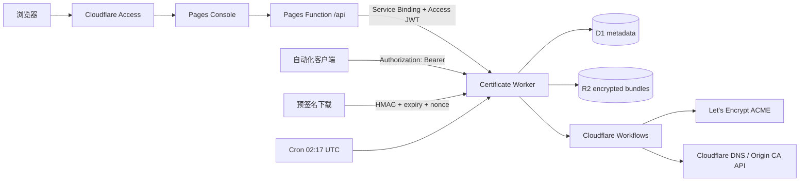

# Certbot Serverless

一个运行在 Cloudflare 上的单用户证书控制台。它签发两类证书：

- **Let's Encrypt**：通过 Cloudflare DNS API 完成 DNS-01，可签发公开可信证书和通配符证书。
- **Cloudflare Origin CA**：用于 Cloudflare 代理到源站的 TLS；它不是浏览器公开信任的 CA。

前端是 React、Vite、Tailwind v4 和 shadcn/ui 风格组件，部署到 Pages。API、定时任务和签发流程运行在 Workers；D1 保存元数据，R2 保存经 AES-256-GCM 加密的证书与私钥，Workflows 承载可重试的签发任务。

## 架构



三种入口互不冲突：

1. 管理台域名由 Zero Trust Access 保护，Access JWT 通过 Pages Function 的 Service Binding 转交给 Worker，Worker再次校验签名、issuer 和 audience。
2. 自动化请求直接使用 `Authorization: Bearer <API_BEARER_TOKEN>`。
3. 下载端点使用最多 1 小时、默认 5 分钟且只能消费一次的预签名 URL。

不要给整个 API 域名再套一个通配的 Access Application，否则只有 Bearer 或预签名参数的请求会在到达 Worker 前被 Access 拦截。Access 应保护 Pages 管理台；API 的每个非下载端点仍由 Worker 强制认证。

## 仓库结构

```text
apps/
  api/                 Worker API、Workflow、D1 migration
  web/                 Pages 管理台和 /api Service Binding 代理
scripts/
  init-local-secrets.mjs
STYLE.md               界面设计规范
```

## 本地开发

要求 Node.js 22+ 和 pnpm 11。

```bash
pnpm install
pnpm secrets:local
```

编辑 `apps/api/.dev.vars`，将 `CLOUDFLARE_API_TOKEN` 替换成真实的最小权限 API Token。本地配置默认使用 Let's Encrypt staging，避免消耗生产环境签发限额。

初始化本地 D1：

```bash
pnpm exec wrangler d1 migrations apply certbot-serverless --local -c apps/api/wrangler.jsonc
```

启动前后端：

```bash
pnpm dev
```

- Pages UI：`http://localhost:5173`
- Worker API：`http://localhost:8788`

Vite 代理只在本地读取 `apps/web/.env.local`，并为 `/api` 请求附加 Bearer Token；该值不会进入前端产物。

## Cloudflare 资源

先登录，并创建 D1 与 R2：

```bash
pnpm exec wrangler login
pnpm exec wrangler d1 create certbot-serverless --location apac
pnpm exec wrangler r2 bucket create certbot-serverless-certificates --location apac
```

将 D1 命令返回的 `database_id` 写入 [apps/api/wrangler.jsonc](apps/api/wrangler.jsonc)，并修改：

- `DOWNLOAD_URL_BASE`：Worker 的公开自定义域名，例如 `https://cert-api.example.com`。
- `ACCESS_TEAM_DOMAIN`：例如 `https://your-team.cloudflareaccess.com`。
- `ACCESS_AUD`：Pages Access Application 的 Audience Tag。

生产环境 Cloudflare API Token 至少需要：

- Zone / Zone / Read
- Zone / DNS / Edit
- Zone / SSL and Certificates / Edit

建议只允许需要签发证书的 Zone。所有敏感值都使用 Workers secrets，不要写入 `wrangler.jsonc`。

创建或准备以下五个 secret：

| Secret | 用途 |
| --- | --- |
| `CLOUDFLARE_API_TOKEN` | DNS-01 和 Origin CA API |
| `API_BEARER_TOKEN` | 自动化 API 鉴权 |
| `DOWNLOAD_SIGNING_KEY` | HMAC 预签名下载，32-byte base64 |
| `CERTIFICATE_MASTER_KEY` | R2 内容加密，32-byte base64 |
| `ACME_ACCOUNT_KEY` | Let's Encrypt ACME 账户 PKCS#8 PEM 私钥 |

可用以下命令生成材料，再通过交互式 `wrangler secret put` 输入，避免 secret 出现在 shell 参数中：

```bash
openssl rand -base64 32
openssl rand -base64 32
openssl rand -base64 32
openssl genpkey -algorithm EC -pkeyopt ec_paramgen_curve:P-256 -out acme-account.pem

pnpm --filter @certbot/api exec wrangler secret put CLOUDFLARE_API_TOKEN
pnpm --filter @certbot/api exec wrangler secret put API_BEARER_TOKEN
pnpm --filter @certbot/api exec wrangler secret put DOWNLOAD_SIGNING_KEY
pnpm --filter @certbot/api exec wrangler secret put CERTIFICATE_MASTER_KEY
pnpm --filter @certbot/api exec wrangler secret put ACME_ACCOUNT_KEY
```

对远程 D1 执行 migration，然后部署 Worker：

```bash
pnpm exec wrangler d1 migrations apply certbot-serverless --remote -c apps/api/wrangler.jsonc
pnpm --filter @certbot/api deploy
```

首次部署 Pages 时创建名为 `certbot-serverless-console` 的 Pages 项目；随后：

```bash
pnpm --filter @certbot/web deploy
```

Pages 配置中的 `API` Service Binding 指向 `certbot-serverless-api`。如果通过 Dashboard 管理绑定，变量名也必须是 `API`，修改后重新部署 Pages。

## Zero Trust 配置

1. 为 Pages 的生产自定义域名创建一个 Self-hosted Access Application。
2. 创建可复用的 Allow Policy，只包含你的邮箱或 IdP 用户组；不要使用 `Include Everyone`。
3. 将 Application Audience Tag 写入 Worker 的 `ACCESS_AUD`。
4. 部署后访问 Pages，确认 `/api/me` 返回 `method: access`。
5. Worker 自定义域名保持可路由，由 Worker 对 `/api/*` 验证 Access JWT 或 Bearer，对 `/download/*` 验证预签名。

Access 公钥会轮换，Worker 使用 Access 的远程 JWKS 地址动态验证，不固定保存公钥。

## API

除健康检查和预签名下载外，所有 `/api/*` 都接受有效的 Access JWT 或 Bearer Token。

| Method | Path | 说明 |
| --- | --- | --- |
| `GET` | `/api/health` | 无敏感信息的健康检查 |
| `GET` | `/api/overview` | 控制台统计和近期任务 |
| `GET` | `/api/certificates` | 证书列表 |
| `POST` | `/api/certificates` | 创建证书并启动 Workflow |
| `GET` | `/api/certificates/:id` | 证书、版本与任务详情 |
| `PATCH` | `/api/certificates/:id` | 开关自动续期 |
| `POST` | `/api/certificates/:id/renew` | 手动续期 |
| `POST` | `/api/certificates/:id/download-link` | 创建一次性下载链接 |
| `DELETE` | `/api/certificates/:id` | 删除存储；Origin CA 同时撤销证书 |
| `GET` | `/api/jobs/:id` | 查询任务 |
| `GET` | `/api/audit` | 最近 100 条审计记录 |

示例：

```bash
curl https://cert-api.example.com/api/certificates \
  -H "Authorization: Bearer $CERTBOT_TOKEN"
```

下载 ZIP 包含 `cert.pem`、`chain.pem`、`fullchain.pem`、`privkey.pem`、`request.csr` 和 `metadata.json`。

## 续期行为

- 每天 `02:17 UTC` 扫描到达续期窗口的证书。
- Let's Encrypt 默认提前 30 天续期。
- Origin CA 默认提前 60 天续期；15 年有效期是默认选择。
- 每次续期生成新的证书私钥和 R2 版本，旧版本保留，便于回滚源站配置。
- 相同证书已有 queued/running 任务时不会重复启动。

## 验证

```bash
pnpm check
```

这会执行 TypeScript 检查、单元测试、Pages 生产构建和 Worker `wrangler deploy --dry-run`。真实签发与部署需要你的 Cloudflare 账户资源和 secrets，因此不会在仓库测试中调用生产 API。

## 参考

- [Cloudflare Access JWT validation](https://developers.cloudflare.com/cloudflare-one/access-controls/applications/http-apps/authorization-cookie/validating-json/)
- [Pages Service Bindings](https://developers.cloudflare.com/pages/functions/bindings/#service-bindings)
- [Cloudflare Origin CA](https://developers.cloudflare.com/ssl/origin-configuration/origin-ca/)
- [Cloudflare Workflows](https://developers.cloudflare.com/workflows/)
- [Let's Encrypt DNS-01](https://letsencrypt.org/docs/challenge-types/#dns-01-challenge)
